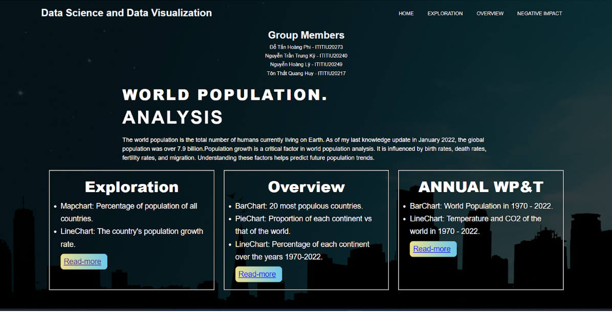
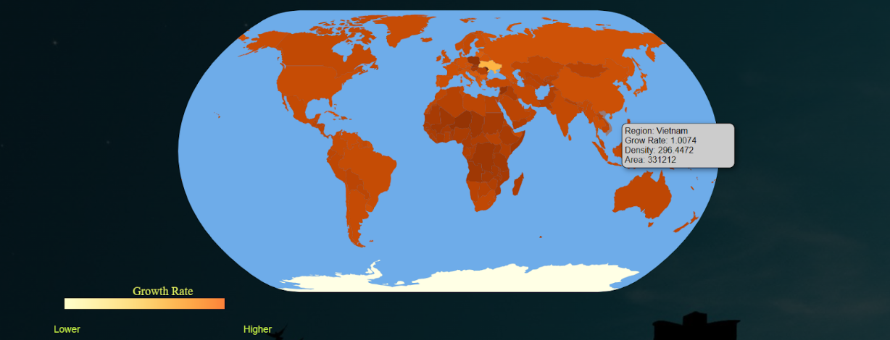
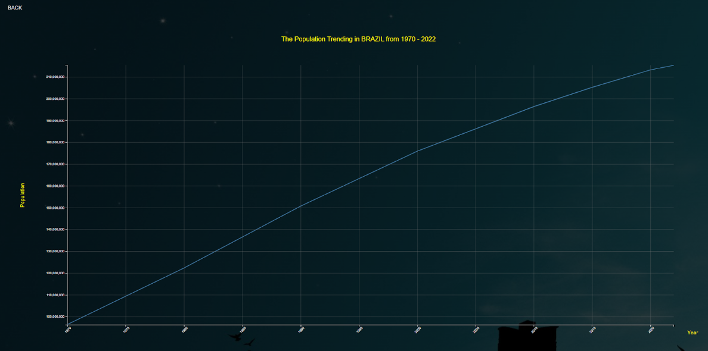
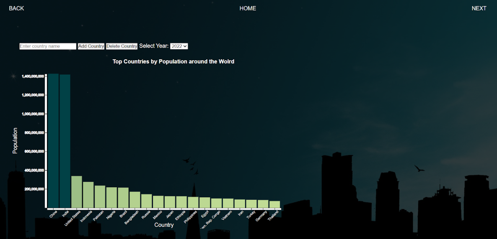
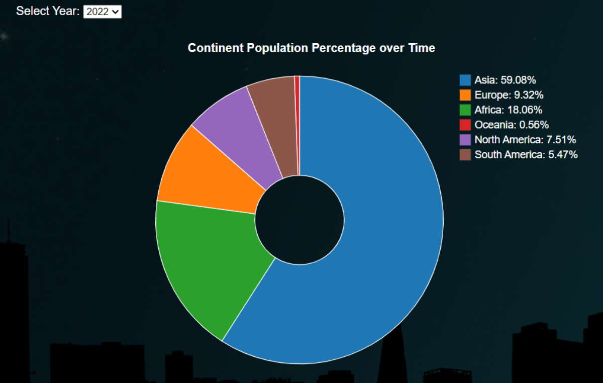
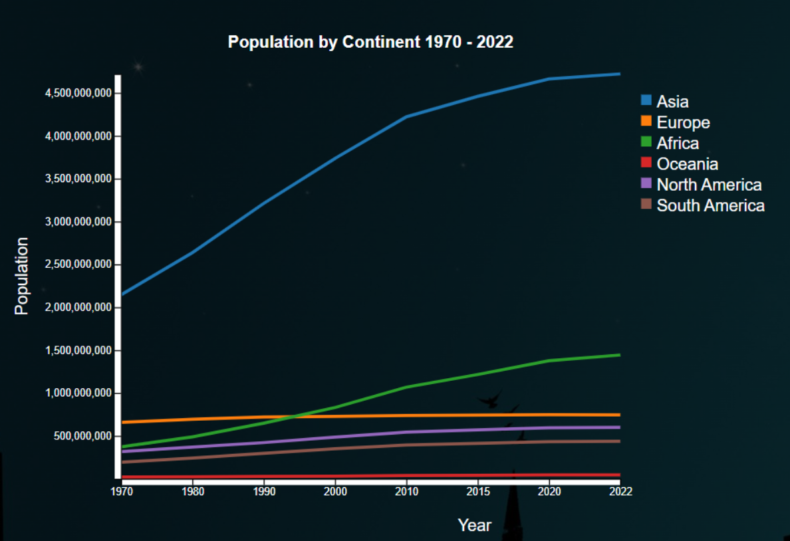
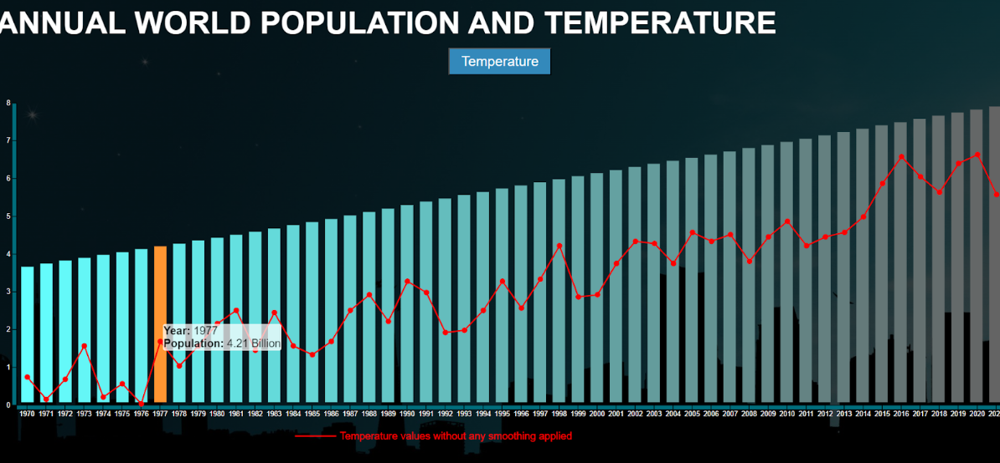
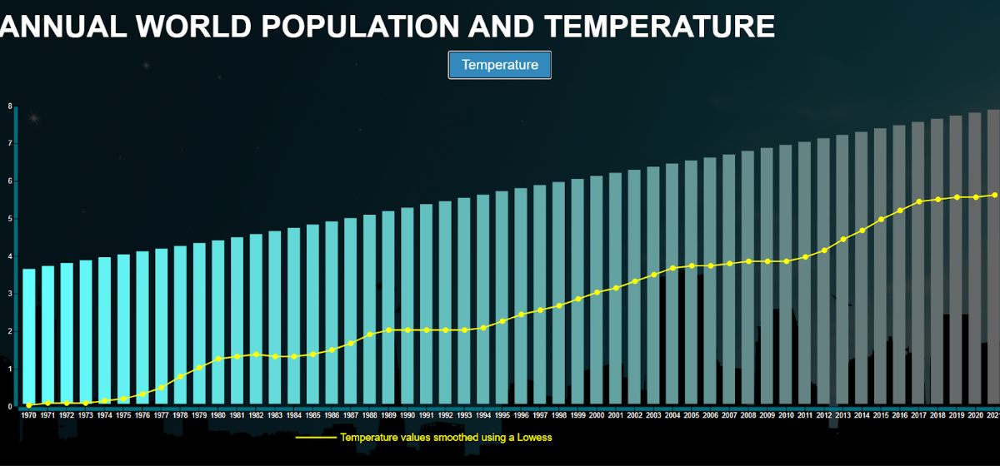
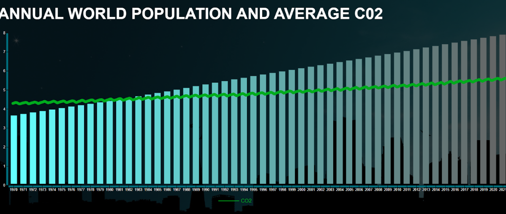

# World Population Analysis

This project provides an interactive and dynamic dashboard to analyze and visualize global population data, trends, and their environmental impacts.

## Project Overview

The dashboard allows users to explore population data across different countries and continents from 1970 to 2022. Users can interact with various visualizations including maps, bar charts, pie charts, and line charts to gain insights into population trends.

## Features

- **Interactive Map:** View and explore global population distribution by country.
- **Ranking Bar Chart:** Compare population rankings of the top 20 countries.
- **Pie Chart:** Analyze the percentage distribution of the population by continent.
- **Line Chart:** Track changes in population trends over time by continent.

## Demo

Here’s a snapshot of the dashboard:











## Getting Started

### Prerequisites

- Install [Visual Studio Code](https://code.visualstudio.com/).
- Install necessary packages using npm:

```bash
  npm install

```bash
  npm start
